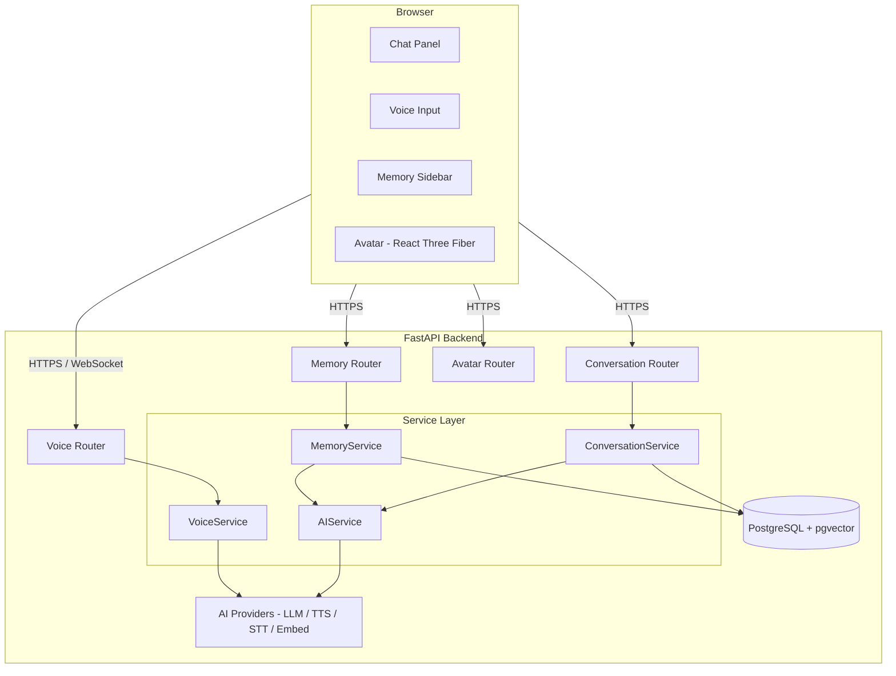
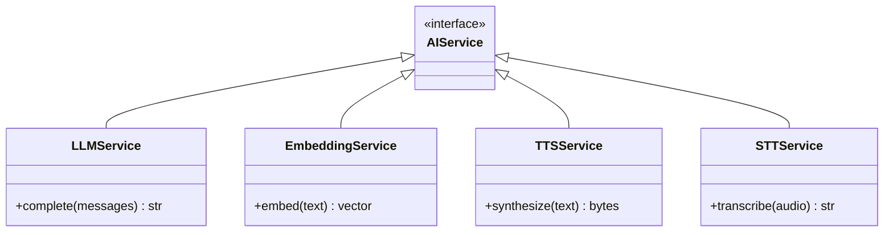
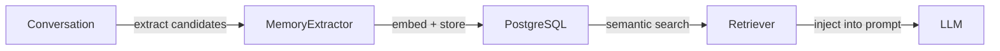
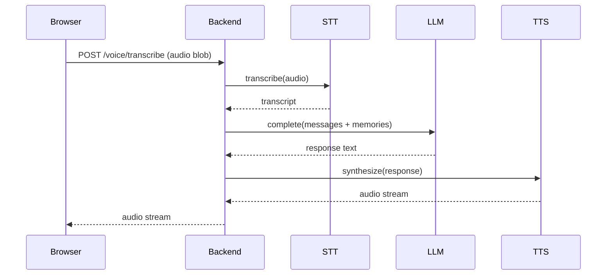
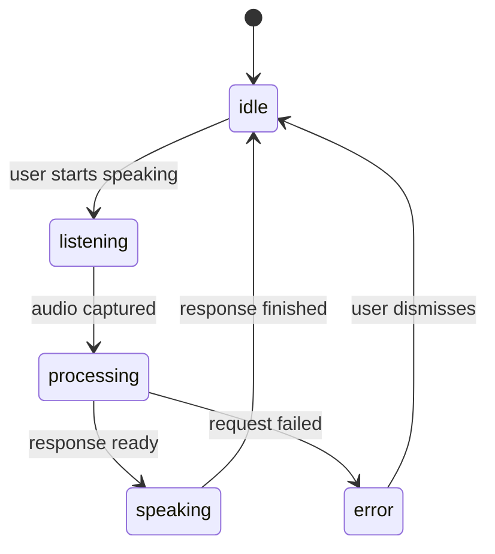

# Architecture

## Overview

Buddy is a monorepo with a Next.js frontend (`apps/web`), a FastAPI backend (`apps/api`), and a shared TypeScript package (`packages/shared`) for types and API contracts. The two apps talk over HTTP. The frontend never calls any AI provider directly — all AI work, memory operations, and data access live in the backend.

---

## System Overview



---

## Frontend

| | |
|---|---|
| Framework | Next.js 14, App Router |
| Language | TypeScript |
| Styling | Tailwind CSS |
| Animation | Framer Motion |
| 3D rendering | React Three Fiber |
| UI state | Zustand |
| Server state | TanStack Query |

The frontend owns UI state only. Conversation flow, voice recording, and memory panel state live in Zustand stores. All data fetching goes through TanStack Query against the backend API.

---

## Backend

| | |
|---|---|
| Framework | FastAPI |
| Language | Python 3.11+ |
| Validation | Pydantic v2 |
| ORM | SQLModel |
| Database | PostgreSQL 15 |
| Vector search | pgvector |
| Cache | Redis (optional) |

Business logic lives entirely in the service layer. Route handlers are thin: validate input, call a service, return a response.

---

## AI Layer

Every AI capability is accessed through a typed interface. Route handlers never import a provider SDK directly. Swapping providers means writing a new implementation class, nothing else.



During development all services use mock implementations with deterministic responses. Real providers are wired in during milestones M2 and M3.

---

## Memory Layer

Memory runs at two levels.

**Short-term context** is the current conversation history sent with every LLM request. When a conversation grows long, older messages are summarized and the summary replaces the raw history in the prompt.

**Long-term memory** is a set of extracted facts stored in PostgreSQL with vector embeddings. At the start of each session the most relevant memories are retrieved by semantic similarity and injected into the system prompt.



Full design: [memory-design.md](memory-design.md)

---

## Voice Layer

Voice input is recorded in the browser with the Web Audio API and sent to the backend as an audio blob. The backend transcribes it with the STT service, generates a response with the LLM, and streams synthesized audio back via the TTS service.



Later phases replace this with a persistent WebSocket session via the OpenAI Realtime API.

Full design: [voice-design.md](voice-design.md)

---

## Avatar Layer

The avatar is a Three.js scene rendered with React Three Fiber. It reads avatar state from Zustand and transitions between five states.



Mouth movement in early phases is driven by audio amplitude. Viseme-based lip sync is planned for a later milestone.

Full design: [avatar-design.md](avatar-design.md)

---

## Database Schema

```sql
users
  id, email, password_hash, memory_enabled,
  created_at, updated_at

conversations
  id, user_id, title,
  created_at, updated_at

messages
  id, conversation_id, role, content,
  created_at

memories
  id, user_id, content, embedding (vector),
  source_conversation_id, confidence,
  reviewed, deleted_at, created_at, updated_at
```

---

## Local Infrastructure

Docker Compose starts PostgreSQL and Redis. The Next.js dev server and uvicorn run on the host directly for faster hot-reload iteration.

See [../infra/docker-compose.yml](../infra/docker-compose.yml).
